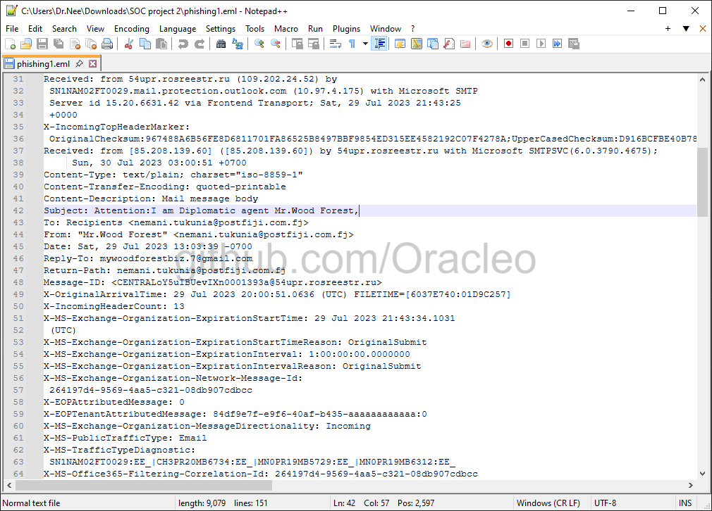
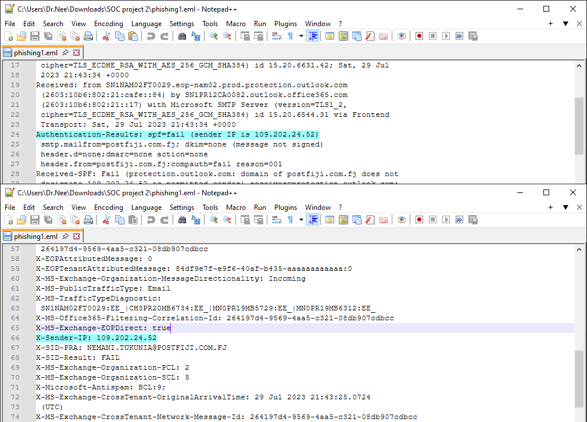
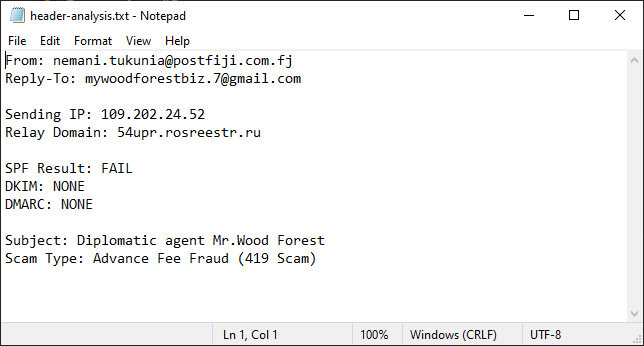
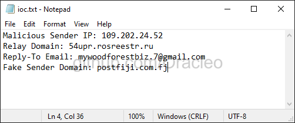
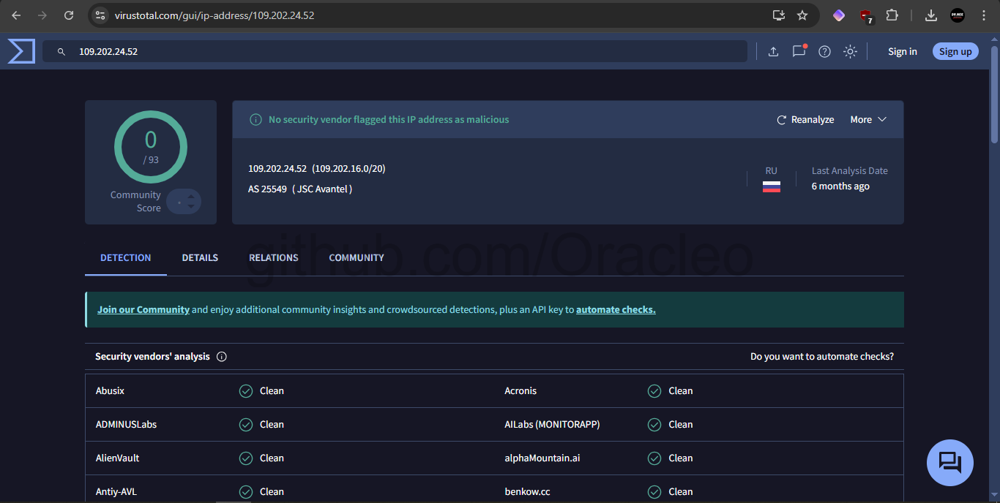
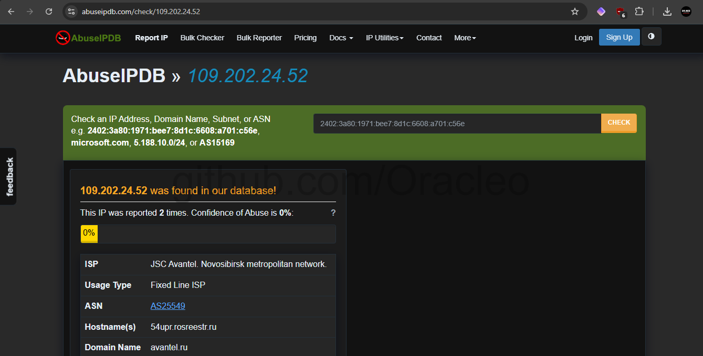
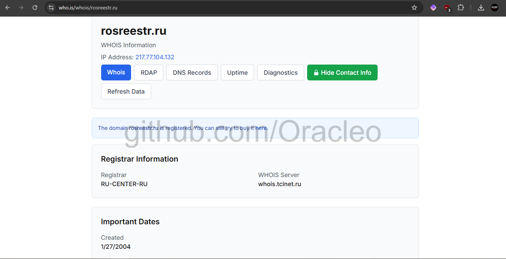
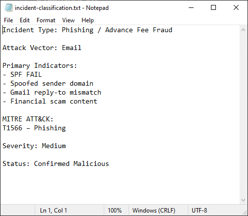

# Phishing Email Investigation & Analysis

[](https://attack.mitre.org/)
[]()
[]()

A comprehensive Security Operations Center Level-1 phishing investigation demonstrating email header analysis, indicator of compromise extraction, threat intelligence enrichment, and professional incident documentation.

---

## 📋 Table of Contents

- [Overview](#overview)
- [Investigation Methodology](#investigation-methodology)
- [Technical Analysis](#technical-analysis)
- [Threat Intelligence Findings](#threat-intelligence-findings)
- [MITRE ATT&CK Mapping](#mitre-attck-mapping)
- [Indicators of Compromise](#indicators-of-compromise)
- [Screenshots](#screenshots)
- [Incident Classification](#incident-classification)
- [Response Actions](#response-actions)
- [Skills Demonstrated](#skills-demonstrated)
- [Repository Structure](#repository-structure)
- [Author](#author)

---

## 🎯 Overview

This project documents a complete SOC analyst workflow for investigating a suspected phishing email. A real-world phishing sample impersonating a diplomatic agent was analyzed to identify malicious indicators, perform threat intelligence correlation, classify the incident according to industry frameworks, and produce actionable incident documentation suitable for enterprise security operations.

**Investigation Summary:**

The analyzed email represented an advance fee fraud scheme (commonly known as a 419 scam) wherein the sender impersonated a diplomatic courier claiming to possess a substantial monetary shipment requiring the recipient's personal information for delivery. Through systematic analysis of email headers, authentication records, and infrastructure investigation, the email was definitively classified as a phishing attempt with medium severity.

**Key Findings:**

The investigation revealed multiple technical indicators of malicious activity including SPF authentication failure, domain spoofing, reply-to address redirection to a free email provider, and infrastructure hosted on compromised Russian relay servers. Despite relatively low reputation scores in automated threat intelligence platforms, the combination of authentication failures and social engineering tactics confirmed the malicious nature of the communication.

---

## 🎓 Investigation Methodology

This investigation followed standard SOC Level-1 phishing analysis procedures, encompassing the following phases:

### Phase 1: Email Acquisition and Preservation

The suspicious email was obtained in EML format to preserve complete header information and message content for forensic analysis. The original email file was archived to maintain evidence integrity throughout the investigation process.

### Phase 2: Header Analysis and Authentication Verification

Email headers were systematically extracted and analyzed to identify routing information, authentication results, and transmission anomalies. Particular attention was paid to SPF (Sender Policy Framework), DKIM (DomainKeys Identified Mail), and DMARC (Domain-based Message Authentication, Reporting, and Conformance) authentication mechanisms to determine whether the email originated from legitimate infrastructure.

The analysis revealed that the email failed SPF validation, indicating that the sending IP address was not authorized to send mail on behalf of the claimed sender domain. Additionally, both DKIM and DMARC protections were entirely absent, eliminating cryptographic verification of message authenticity and organizational email policy enforcement.

### Phase 3: Indicator of Compromise Extraction

Critical indicators were systematically extracted from the email headers and content for further investigation. These indicators included the originating IP address, relay domain infrastructure, reply-to email address, and the spoofed sender domain. Each indicator was documented for subsequent threat intelligence enrichment and potential blocking actions.

### Phase 4: Threat Intelligence Enrichment

Extracted indicators were submitted to multiple threat intelligence platforms to assess reputation, identify previous malicious activity reports, and determine infrastructure ownership and geolocation. The investigation utilized VirusTotal for multi-engine malware and reputation scanning, AbuseIPDB for abuse report correlation, and WHOIS services for domain registration and ownership verification.

### Phase 5: Content Analysis and Social Engineering Assessment

The email body was analyzed to identify social engineering techniques, urgency creation, information requests, and other manipulation tactics commonly employed in phishing campaigns. The analysis identified classic advance fee fraud patterns including claims of substantial monetary amounts, requests for personal identifying information, and creation of artificial time pressure.

### Phase 6: Incident Classification and Documentation

Based on the cumulative evidence from technical analysis and threat intelligence correlation, the incident was classified according to organizational severity criteria and mapped to the MITRE ATT&CK framework for standardized threat categorization. A comprehensive incident report was produced documenting findings, impact assessment, and recommended response actions.

---

## 📊 Technical Analysis

### Email Authentication Results

**SPF (Sender Policy Framework): FAIL**

The sending IP address 109.202.24.52 was not authorized in the SPF record for the claimed sender domain postfiji.com.fj. This failure indicates that either the sender domain was spoofed or the email was transmitted through unauthorized infrastructure, both of which are strong indicators of malicious activity.

**DKIM (DomainKeys Identified Mail): NONE**

No DKIM signature was present in the email headers. The absence of cryptographic signing prevents verification that the message originated from the claimed sender domain and that the message content was not altered during transmission.

**DMARC (Domain-based Message Authentication, Reporting, and Conformance): NONE**

No DMARC policy was published by the sender domain, eliminating the ability to verify organizational email handling policies and determine appropriate actions for authentication failures.

### Sender Information Analysis

**Displayed Sender:** nemani.tukunia@postfiji.com.fj

The email claimed to originate from an address associated with Post Fiji, the national postal service of Fiji. However, the SPF failure and subsequent infrastructure analysis indicate that this sender address was spoofed to lend legitimacy to the fraudulent communication.

**Reply-To Address:** mywoodforestbiz.7@gmail.com

The reply-to header was configured to redirect responses to a Gmail address rather than the displayed sender domain. This mismatch is a common phishing tactic that allows attackers to receive replies without controlling the spoofed domain's mail infrastructure. The use of a free email provider for business correspondence is itself a significant red flag.

### Infrastructure Analysis

**Originating IP Address:** 109.202.24.52

The email was transmitted from IP address 109.202.24.52, which resolved to ISP infrastructure in Russia operated by JSC Avantel. This IP address was not authorized to send mail for the postfiji.com.fj domain, resulting in SPF authentication failure.

**Relay Domain:** 54upr.rosreestr.ru

The email was relayed through a subdomain of rosreestr.ru, a Russian government domain associated with the Federal Service for State Registration, Cadastre and Cartography. The presence of this relay infrastructure suggests that either the legitimate domain was compromised and abused for email relay purposes, or the attackers specifically selected Russian infrastructure to complicate attribution and enforcement actions.

### Message Content Analysis

**Subject Line:** "Attention:I am Diplomatic agent Mr.Wood Forest"

The subject line employs authority and urgency through the claim of diplomatic status. The use of official-sounding titles is designed to bypass recipient skepticism and create a perception of legitimate governmental communication.

**Social Engineering Tactics:**

The email body employed multiple social engineering techniques characteristic of advance fee fraud schemes. The message claimed that a diplomatic courier was in possession of 10.5 million USD designated for the recipient, requiring only personal information to facilitate delivery. This narrative creates both greed motivation (substantial monetary gain) and urgency (immediate action required) to bypass rational decision-making processes.

The request for personal identifying information including full name, residential address, telephone number, and occupation is designed to facilitate subsequent fraud attempts or identity theft. Compliance with these requests would provide attackers with sufficient information to impersonate the victim, open fraudulent accounts, or conduct targeted social engineering against the victim's contacts.

---

## 🔍 Threat Intelligence Findings

### VirusTotal Analysis

**IP Address 109.202.24.52:**

Submission of the sender IP address to VirusTotal yielded a detection rate of 0 out of 93 security vendors at the time of analysis. This result indicates that the IP address has not yet been widely recognized as malicious by automated threat intelligence feeds and antivirus engines.

The absence of detections in VirusTotal does not indicate benign activity, but rather suggests that this particular infrastructure has not been extensively used for large-scale campaigns that would trigger widespread blocklisting. Newly established or infrequently used infrastructure often presents low detection rates in automated systems, emphasizing the importance of manual analysis and authentication verification in phishing investigations.

**Infrastructure Geolocation:**

The IP address was geolocated to Russia and identified as belonging to ASN 25549 (JSC Avantel), a fixed-line Internet Service Provider serving the Novosibirsk metropolitan network. This geolocation is inconsistent with the claimed sender domain in Fiji, providing additional evidence of email spoofing or infrastructure compromise.

### AbuseIPDB Correlation

**IP Address 109.202.24.52:**

The sender IP address appeared in the AbuseIPDB database with two previous abuse reports, however the confidence of abuse score remained at 0 percent. This low confidence score indicates that while the IP address has been reported for suspicious activity, the volume and recency of reports have not yet reached thresholds that would generate high-confidence malicious classification.

**Hostname Resolution:**

AbuseIPDB identified the hostname as 54upr.rosreestr.ru, confirming the Russian relay infrastructure identified in email header analysis. The domain name avantel.ru was associated with the IP address, corresponding to the Internet Service Provider allocation.

### WHOIS Domain Investigation

**Domain:** rosreestr.ru

WHOIS investigation of the relay domain rosreestr.ru confirmed that the domain is registered through RU-CENTER-RU, a Russian domain registrar. The domain was originally created on January 27, 2004, indicating long-term registration consistent with legitimate governmental infrastructure that has subsequently been compromised or abused for email relay purposes.

**IP Address Associated:** 217.77.104.132

The WHOIS record indicated that the primary rosreestr.ru domain resolves to IP address 217.77.104.132, distinct from the sender IP address 109.202.24.52. This suggests that the subdomain 54upr.rosreestr.ru was specifically configured to facilitate email relay activities separate from the legitimate domain infrastructure.

### Threat Intelligence Synthesis

The combination of threat intelligence sources provides a nuanced picture of the attack infrastructure. While automated reputation systems have not yet widely flagged the sender IP address as malicious, the technical indicators (SPF failure, domain spoofing, Russian relay infrastructure, Gmail reply-to mismatch) combined with the fraudulent message content provide definitive evidence of phishing activity.

This case demonstrates the limitation of relying solely on automated reputation feeds for phishing detection. Attackers frequently employ newly established or previously legitimate compromised infrastructure that has not yet accumulated sufficient abuse reports to trigger automated blocking systems. Effective phishing analysis requires the integration of authentication verification, infrastructure investigation, and content analysis to identify malicious communications regardless of their reputation scores in threat intelligence databases.

---

## 🎯 MITRE ATT&CK Mapping

The identified attack has been mapped to the MITRE ATT&CK framework for standardized threat classification and communication with other security teams and stakeholders.

**Tactic:** Initial Access (TA0001)

Adversaries attempt to gain initial access to target networks and systems through various entry vectors including phishing and other social engineering techniques.

**Technique:** Phishing (T1566)

Adversaries send phishing messages to gain access to victim systems or to collect credentials and other sensitive information. Phishing messages may take various forms including email, instant messages, or messages delivered through third-party services.

**Sub-technique:** Spearphishing Link (T1566.002)

While this particular sample did not contain embedded links, the advance fee fraud pattern typically progresses to subsequent communications containing malicious links or attachments once the victim demonstrates engagement with the initial message.

**Detection Method:**

Phishing emails can be detected through analysis of email authentication mechanisms (SPF, DKIM, DMARC), examination of sender domain legitimacy, identification of sender-reply-to mismatches, content analysis for social engineering indicators, and correlation with threat intelligence feeds regarding sender infrastructure reputation.

**Mitigation Strategies:**

Organizations can mitigate phishing risks through implementation of email authentication protocols (SPF, DKIM, DMARC), deployment of email gateway filtering with reputation-based blocking, user awareness training focused on social engineering recognition, implementation of multi-factor authentication to reduce credential compromise impact, and establishment of clear procedures for reporting suspicious communications.

**Reference:** https://attack.mitre.org/techniques/T1566/

---

## 🚨 Indicators of Compromise

The following indicators of compromise were extracted during the investigation and should be considered for blocking, monitoring, or alerting within organizational security infrastructure:

**Malicious Sender IP Address:**
```
109.202.24.52
```
Geographic Location: Russia  
ISP: JSC Avantel  
ASN: AS25549  
Recommended Action: Block in email gateway and firewall rules

**Compromised Relay Domain:**
```
54upr.rosreestr.ru
```
Infrastructure: Subdomain of Russian government domain  
Status: Likely compromised and abused for mail relay  
Recommended Action: Block subdomain in email gateway while preserving legitimate rosreestr.ru communications if organizationally relevant

**Attacker-Controlled Reply-To Email:**
```
mywoodforestbiz.7@gmail.com
```
Platform: Gmail free email service  
Recommended Action: Block specific address in email gateway and add to phishing blacklist

**Spoofed Sender Domain:**
```
postfiji.com.fj
```
Organization: Post Fiji (legitimate postal service)  
Status: Domain spoofed by attacker  
Recommended Action: Implement strict SPF validation to block unauthorized senders claiming this domain; consider adding to DMARC monitoring for organizational domains to detect similar spoofing attempts

**Additional Detection Signatures:**

Subject Line Pattern: "Diplomatic agent" combined with personal names  
Content Pattern: References to unclaimed funds, diplomatic shipments, or consignment deliveries  
Social Engineering Pattern: Requests for personal identifying information (full name, address, telephone)  
Authentication Pattern: SPF FAIL + No DKIM + No DMARC + Reply-To mismatch

---

## 📸 Screenshots

Visual documentation of the complete phishing email investigation workflow.

### Email Header Analysis

#### Raw Email Header Examination


The complete email headers displayed in Notepad++, showing the full message routing path including the originating IP address (109.202.24.52), relay domain (54upr.rosreestr.ru), authentication results, and Microsoft Exchange server processing. The headers reveal critical forensic information including X-Sender-IP, Received headers documenting the complete transmission path, and authentication failure indicators.

#### SPF Authentication Failure


Detail view of the authentication results section showing "spf=fail (sender IP is 109.202.24.52)" which indicates that the sending IP address was not authorized in the SPF record for the postfiji.com.fj domain. This failure is visible in line 24 of the headers and represents definitive evidence that the sender domain was either spoofed or the email was transmitted through unauthorized infrastructure.

---

### Investigation Analysis Files

#### Header Analysis Summary


Structured analysis document summarizing the key findings from email header examination. The file documents the sender address (nemani.tukunia@postfiji.com.fj), reply-to mismatch (mywoodforestbiz.7@gmail.com), sending IP address, relay domain, complete absence of authentication protections (SPF FAIL, DKIM NONE, DMARC NONE), and preliminary classification as an advance fee fraud scheme.

#### Indicators of Compromise Extraction


Compiled list of all extracted indicators of compromise including the malicious sender IP address, relay domain infrastructure, attacker-controlled reply-to email address, and spoofed sender domain. This structured IOC documentation enables efficient distribution to security tools for blocking and monitoring purposes.

---

### Threat Intelligence Enrichment

#### VirusTotal IP Reputation Analysis


VirusTotal analysis results for IP address 109.202.24.52 showing 0 detections out of 93 security vendors. The community score indicates no current flags from automated security tools. The analysis reveals the IP is associated with AS25549 (JSC Avantel) in Russia with last analysis date approximately six months prior to the investigation, indicating relatively low visibility in automated threat intelligence feeds.

#### AbuseIPDB Correlation


AbuseIPDB database lookup revealing that IP address 109.202.24.52 has been reported twice for abusive activity, however the confidence of abuse score remains at 0 percent. The listing shows the ISP as JSC Avantel serving the Novosibirsk metropolitan network, the hostname as 54upr.rosreestr.ru, and domain name as avantel.ru, confirming the Russian infrastructure identification from header analysis.

#### WHOIS Domain Investigation


WHOIS information for the rosreestr.ru domain showing registration through RU-CENTER-RU registrar, IP address 217.77.104.132, and domain creation date of January 27, 2004. The WHOIS data confirms this is legitimate Russian government infrastructure that has been compromised or abused for email relay purposes, as evidenced by the subdomain usage in the attack.

---

### Incident Classification

#### Final Incident Assessment


Comprehensive incident classification document categorizing the email as Phishing/Advance Fee Fraud with email as the primary attack vector. The classification lists key indicators including SPF failure, spoofed sender domain, Gmail reply-to mismatch, and fraudulent financial content. The incident is mapped to MITRE ATT&CK technique T1566 (Phishing), assigned medium severity based on the combination of technical indicators and social engineering tactics, and marked as confirmed malicious despite low automated reputation scores.

---

## 🔐 Incident Classification

**Incident Type:** Phishing / Advance Fee Fraud (419 Scam)

**Attack Vector:** Email

**Primary Technical Indicators:**

The incident was classified as confirmed malicious phishing based on multiple technical authentication failures combined with social engineering content analysis. The SPF authentication failure provided definitive evidence that the email did not originate from authorized infrastructure for the claimed sender domain. The complete absence of DKIM and DMARC protections eliminated the possibility of cryptographic verification or organizational policy enforcement.

The configuration of the reply-to header to redirect responses to a Gmail address rather than the sender domain represents a clear indicator of fraudulent intent, as legitimate organizational communications would maintain consistent sender and reply-to addresses within the organization's domain.

**Social Engineering Assessment:**

The email content employed classic advance fee fraud tactics including claims of substantial monetary holdings, creation of urgency through diplomatic courier narratives, and requests for personal identifying information allegedly required for delivery processing. These social engineering techniques are designed to bypass rational decision-making through appeals to greed and urgency.

**Infrastructure Analysis:**

The identification of Russian relay infrastructure combined with a spoofed Fiji sender domain indicates sophisticated infrastructure abuse. The use of a legitimate government subdomain (rosreestr.ru) for email relay purposes suggests either compromise of that infrastructure or deliberate selection of trusted domains to evade basic reputation filtering.

**MITRE ATT&CK Classification:** T1566 (Phishing)

**Severity Assessment:** Medium

The incident was assigned medium severity based on the following factors. The email was successfully delivered to the recipient mailbox, indicating that existing email gateway controls did not prevent delivery based on reputation or content filtering. The social engineering tactics employed are moderately sophisticated and may be convincing to users without security awareness training. However, the lack of malicious attachments or links in the initial message reduces immediate compromise risk, as victim engagement requires proactive response to the fraudulent communication.

**Status:** Confirmed Malicious

---

## 🛡️ Response Actions

Based on the investigation findings, the following response actions were recommended and documented for organizational implementation:

### Immediate Technical Controls

**Email Gateway Blocking:**

The sender IP address 109.202.24.52 should be blocked in email gateway rules to prevent future messages from this infrastructure. The relay domain 54upr.rosreestr.ru should be added to email filtering rules while maintaining allowances for legitimate communications from the parent rosreestr.ru domain if organizationally relevant.

The specific Gmail address mywoodforestbiz.7@gmail.com should be added to email blocking rules and phishing blacklists. Additionally, email gateway rules should be configured to flag or block messages containing sender-reply-to domain mismatches, particularly when the reply-to address utilizes free email providers in the context of apparently organizational communications.

**SPF Enforcement Enhancement:**

Email gateway configurations should be reviewed to ensure that SPF failures result in message rejection or quarantine rather than delivery with warning headers. Organizations should implement strict SPF validation policies that prevent delivery of messages failing sender authentication checks.

### Strategic Security Improvements

**Email Authentication Implementation:**

Organizations should ensure proper configuration of SPF, DKIM, and DMARC records for all organizational domains to prevent attackers from spoofing organizational addresses in external phishing campaigns. DMARC policies should be configured to request rejection of messages failing authentication checks to maximize protection for recipients.

**User Awareness Training:**

Security awareness training content should be updated to include examples of advance fee fraud schemes and specific indicators of phishing emails including sender-reply-to mismatches, authentication warning headers, requests for personal information, and appeals to greed or urgency. Users should be trained to report suspicious emails through established channels rather than engaging with the content.

**Threat Intelligence Integration:**

Organizations should implement automated threat intelligence feeds that incorporate both reputation-based indicators and authentication validation to identify phishing attempts. Email gateways should be configured to correlate multiple weak indicators (low reputation, authentication failures, content patterns) to identify sophisticated phishing attempts that may not trigger individual high-confidence alerts.

### Documentation and Knowledge Sharing

**Incident Documentation:**

Complete incident documentation has been produced detailing technical findings, threat intelligence correlation, and classification rationale. This documentation serves as both an organizational record and a training resource for security team members conducting similar investigations.

**Security Team Briefing:**

Investigation findings and IOC details have been prepared for distribution to the broader security team to enhance awareness of current threat patterns and infrastructure abuse tactics. The identification of compromised legitimate infrastructure for email relay purposes should inform monitoring strategies for similar abuse patterns.

---

## 💡 Skills Demonstrated

This investigation project demonstrates practical competencies essential for Security Operations Center analyst roles and email security operations:

**Email Security Analysis:**

Comprehensive understanding of email authentication mechanisms including SPF, DKIM, and DMARC, with the ability to interpret authentication results and identify authentication failures indicating spoofing or infrastructure compromise. Proficiency in email header analysis including routing path examination, relay identification, and sender verification.

**Indicator of Compromise Extraction:**

Systematic identification and extraction of technical indicators from email headers and content, with appropriate documentation for distribution to security infrastructure and threat intelligence platforms. Understanding of IOC types and their applications in various security tools including email gateways, firewalls, and SIEM platforms.

**Threat Intelligence Correlation:**

Effective utilization of multiple threat intelligence platforms to enrich indicators with reputation data, abuse history, geolocation information, and infrastructure ownership details. Ability to synthesize information from multiple sources to form comprehensive threat assessments that account for both automated reputation scores and manual analysis findings.

**Social Engineering Recognition:**

Identification of social engineering tactics, manipulation techniques, and psychological triggers employed in phishing campaigns. Understanding of common fraud schemes including advance fee fraud, credential harvesting, and malware distribution, with the ability to classify attacks based on content analysis and likely attacker objectives.

**Incident Classification and Framework Mapping:**

Application of standardized frameworks including MITRE ATT&CK to classify incidents, communicate threats using industry-standard terminology, and enable correlation with threat intelligence and detection strategies. Appropriate severity assessment based on technical indicators, social engineering sophistication, delivery success, and potential organizational impact.

**Professional Documentation:**

Production of clear, comprehensive incident documentation suitable for both technical security team members and non-technical stakeholders. Effective communication of technical findings, assessment rationale, and recommended actions with appropriate detail and professional formatting.

**Critical Thinking and Analysis:**

Demonstration of analytical reasoning to integrate multiple information sources, identify inconsistencies in email claims, correlate technical indicators with content analysis, and form evidence-based conclusions regarding malicious intent despite low automated reputation scores.

---

## 📁 Repository Structure

This repository provides comprehensive documentation of the phishing investigation process:

```
phishing-email-investigation/
├── README.md                          # Complete project documentation
├── setup-instructions.md              # Investigation methodology and tool setup
├── incident-report.md                 # Formal incident documentation
├── header-analysis.txt                # Email header analysis summary
├── ioc.txt                           # Extracted indicators of compromise
├── threat-intel.txt                  # Threat intelligence findings
├── incident-classification.txt        # Final incident classification
├── phishing1.eml                     # Original email sample (preserved)
└── screenshots/
    ├── 01-email-header.png           # Raw email headers
    ├── 02-spf-fail.png               # SPF authentication failure
    ├── 03-header-analysis.png        # Header analysis summary
    ├── 04-ioc-list.png               # Indicators of compromise
    ├── 05-virustotal-ip.png          # VirusTotal IP analysis
    ├── 06-abuseipdb.png              # AbuseIPDB correlation
    ├── 07-whois-domain.png           # WHOIS domain investigation
    └── 08-incident-classification.png # Final classification
```

---

## 👤 Author

**Niladri Biswas**  
M.Tech Information Security (Pursuing)  
West Bengal University of Technology (MAKAUT)

**Professional Profile:**

Cybersecurity postgraduate specializing in Security Operations Center analysis with hands-on experience in threat detection, incident response, and security monitoring. Demonstrated competencies in SIEM operations, phishing analysis, log investigation, and professional security documentation.

**Contact Information:**
- Email: dr.niladribiswas@gmail.com
- LinkedIn: [linkedin.com/in/dr-niladri-biswas](https://linkedin.com/in/dr-niladri-biswas)
- GitHub: [github.com/oracleo](https://github.com/oracleo)
- TryHackMe: [tryhackme.com/p/dr.nee](https://tryhackme.com/p/dr.nee)

**Professional Certifications:**
- ISC2 Certified in Cybersecurity (CC)
- Cisco Ethical Hacker
- Cisco Introduction to Cybersecurity
- TryHackMe PreSecurity Pathway (SOC Fundamentals)

---

## 📝 Usage and Disclaimer

This investigation was conducted using a real phishing email sample for educational and professional development purposes. The methodologies and analysis techniques demonstrated should be applied only to emails within authorized organizational environments or designated training platforms.

Organizations implementing similar phishing analysis procedures should ensure appropriate legal and policy frameworks are in place for email investigation, evidence handling, and threat intelligence sharing. Users should never interact with suspicious links or attachments from phishing emails, even in controlled analysis environments, without appropriate security controls including isolated analysis systems and network segmentation.

---

## 🙏 Acknowledgments

This investigation benefited from threat intelligence provided by VirusTotal, AbuseIPDB, and WHOIS services. The MITRE ATT&CK framework provided standardized threat classification enabling professional communication of findings.

Additional recognition to the information security community for development of email authentication standards including SPF, DKIM, and DMARC that enable technical verification of email authenticity and detection of spoofing attempts.

---

**Investigation Date:** July 29-30, 2023  
**Documentation Date:** February 2026  
**Last Updated:** February 9, 2026

---

⭐ **If this project demonstrates valuable security analysis skills, please consider starring the repository.**

---
